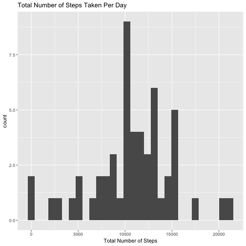
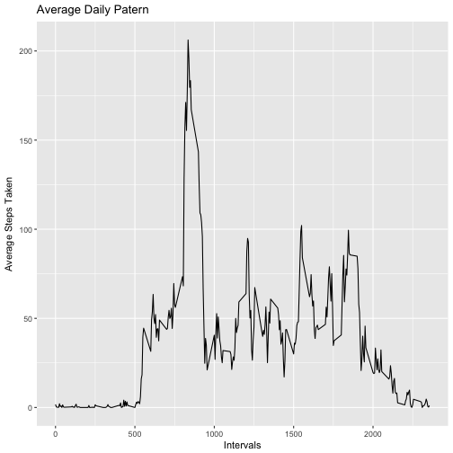
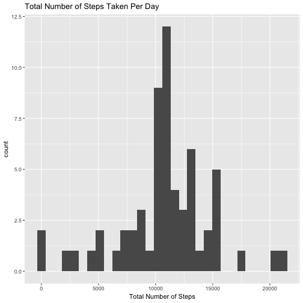
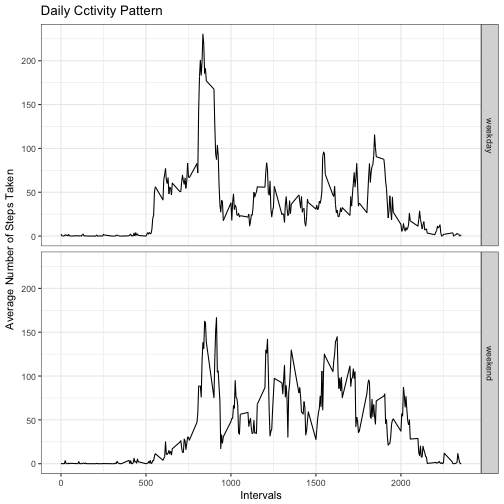

---
output:
  pdf_document: default
  html_document: default
---
Course 5 Project 1
====================

##set working directory and load packages

```r
setwd("/Users/weigeguo/Desktop/coursera")
library(dplyr)
library(ggplot2)
```

##Load and preprocessing data

```r
activitydata <- read.csv("activity.csv")
head(activitydata)
```

```
##   steps       date interval
## 1    NA 2012-10-01        0
## 2    NA 2012-10-01        5
## 3    NA 2012-10-01       10
## 4    NA 2012-10-01       15
## 5    NA 2012-10-01       20
## 6    NA 2012-10-01       25
```

```r
tail(activitydata)
```

```
##       steps       date interval
## 17563    NA 2012-11-30     2330
## 17564    NA 2012-11-30     2335
## 17565    NA 2012-11-30     2340
## 17566    NA 2012-11-30     2345
## 17567    NA 2012-11-30     2350
## 17568    NA 2012-11-30     2355
```

```r
str(activitydata)
```

```
## 'data.frame':	17568 obs. of  3 variables:
##  $ steps   : int  NA NA NA NA NA NA NA NA NA NA ...
##  $ date    : Factor w/ 61 levels "2012-10-01","2012-10-02",..: 1 1 1 1 1 1 1 1 1 1 ...
##  $ interval: int  0 5 10 15 20 25 30 35 40 45 ...
```

##What is mean total number of steps taken per day?

```r
#calculate total numbers of steps per day
q1data <- activitydata %>%
  group_by(date)%>%
  summarise(totalsteps = sum(steps), na.rm = T)
head(q1data)
```

```
## # A tibble: 6 x 3
##         date totalsteps na.rm
##       <fctr>      <int> <lgl>
## 1 2012-10-01         NA  TRUE
## 2 2012-10-02        126  TRUE
## 3 2012-10-03      11352  TRUE
## 4 2012-10-04      12116  TRUE
## 5 2012-10-05      13294  TRUE
## 6 2012-10-06      15420  TRUE
```

```r
#make the plot
ggplot(q1data, aes(x = totalsteps)) +
  geom_histogram() +
  ggtitle("Total Number of Steps Taken Per Day") +
  xlab("Total Number of Steps")
```

```
## `stat_bin()` using `bins = 30`. Pick better value with `binwidth`.
```

```
## Warning: Removed 8 rows containing non-finite values (stat_bin).
```



```r
#calculate the mean and the median
mean(q1data$totalsteps, na.rm = T)
```

```
## [1] 10766.19
```

```r
median(q1data$totalsteps, na.rm = T)
```

```
## [1] 10765
```

As calculated above, among all the days in the two months, the mean of total steps taken each day is 10766, and the median is 10765. 

##What is the average daily activity pattern?

```r
#calculate the mean of each interval across all days
activitydata$interval <- as.factor(activitydata$interval)
q2data <- activitydata %>%
  group_by(interval) %>%
  summarise(average = mean(steps, na.rm = T))
q2data
```

```
## # A tibble: 288 x 2
##    interval   average
##      <fctr>     <dbl>
##  1        0 1.7169811
##  2        5 0.3396226
##  3       10 0.1320755
##  4       15 0.1509434
##  5       20 0.0754717
##  6       25 2.0943396
##  7       30 0.5283019
##  8       35 0.8679245
##  9       40 0.0000000
## 10       45 1.4716981
## # ... with 278 more rows
```

```r
#make the plot
q2data$interval=as.numeric(levels(q2data$interval))[q2data$interval]
ggplot(q2data, aes(interval, average, group = 1))+
  geom_line()+
  xlab("Intervals")+
  ylab("Average Steps Taken") +
  ggtitle("Average Daily Patern")
```



```r
#interval with the maximum number of steps
which.max(q2data$average)
```

```
## [1] 104
```

```r
q2data[104,]
```

```
## # A tibble: 1 x 2
##   interval  average
##      <dbl>    <dbl>
## 1      835 206.1698
```

The interval with the maximum average number of steps taken is 835.

##Imputing missing values

```r
#calculate missing values
sum(is.na(activitydata$steps))
```

```
## [1] 2304
```

```r
#filling in missing values
#First I created a new dataframe with an extra column that shows the mean of that interval
nomissing <- activitydata %>%
  group_by(interval) %>%
  mutate(ave = mean(steps, na.rm = T))

#Then I filled NAs with the mean of that interval
nomissing$steps[is.na(nomissing$steps)] <- nomissing$ave[is.na(nomissing$steps)]

#Create a new dataset that is equal to the original dataset but with the missing data filled in.
nomissing$ave <- NULL
#make the plot
nomissingPlot <- nomissing %>%
  group_by(date) %>%
  summarise(totalsteps2 = sum(steps))

ggplot(nomissingPlot, aes(x = totalsteps2)) +
  geom_histogram() +
  ggtitle("Total Number of Steps Taken Per Day") +
  xlab("Total Number of Steps")
```

```
## `stat_bin()` using `bins = 30`. Pick better value with `binwidth`.
```



```r
#calculate the mean and the medium
mean(nomissingPlot$totalsteps2)
```

```
## [1] 10766.19
```

```r
median(nomissingPlot$totalsteps2)
```

```
## [1] 10766.19
```

There are 2304 missing values.

Since I filled all NAs with the mean of that interval across all days, the mean hasn't changed at all and the median has slightly increased. The overll patern has stayed the same except for the bar after the first pike, which has had a much higher frequency after filling the NAs.

##Are there differences in activity patterns between weekdays and weekends?

```r
#Create a new factor variable in the dataset with two levels – “weekday” and “weekend” indicating whether a given date is a weekday or weekend day.
library(lubridate)
nomissing$date <- ymd(nomissing$date)
nomissing$type <- ifelse(weekdays(nomissing$date) == "Saturday" | weekdays(nomissing$date) == "Sunday", "weekend", "weekday")
table(nomissing$type)
```

```
## 
## weekday weekend 
##   12960    4608
```

```r
nomissing
```

```
## # A tibble: 17,568 x 4
## # Groups:   interval [288]
##        steps       date interval    type
##        <dbl>     <date>   <fctr>   <chr>
##  1 1.7169811 2012-10-01        0 weekday
##  2 0.3396226 2012-10-01        5 weekday
##  3 0.1320755 2012-10-01       10 weekday
##  4 0.1509434 2012-10-01       15 weekday
##  5 0.0754717 2012-10-01       20 weekday
##  6 2.0943396 2012-10-01       25 weekday
##  7 0.5283019 2012-10-01       30 weekday
##  8 0.8679245 2012-10-01       35 weekday
##  9 0.0000000 2012-10-01       40 weekday
## 10 1.4716981 2012-10-01       45 weekday
## # ... with 17,558 more rows
```

```r
#make the plot
plot1 <- nomissing %>%
  group_by(interval)%>%
  mutate(mean = ifelse(type == "weekend",mean(steps[type == "weekend"]), mean(steps[type == "weekday"])))

plot1$interval=as.numeric(levels(plot1$interval))[plot1$interval]
g <- ggplot(plot1, aes(interval, mean))
g + geom_line() + facet_grid(type~.) +
    theme_bw() +
    labs(y="Average Number of Steps Taken") +
    labs(x="Intervals") +
    labs(title="Daily Cctivity Pattern")
```




